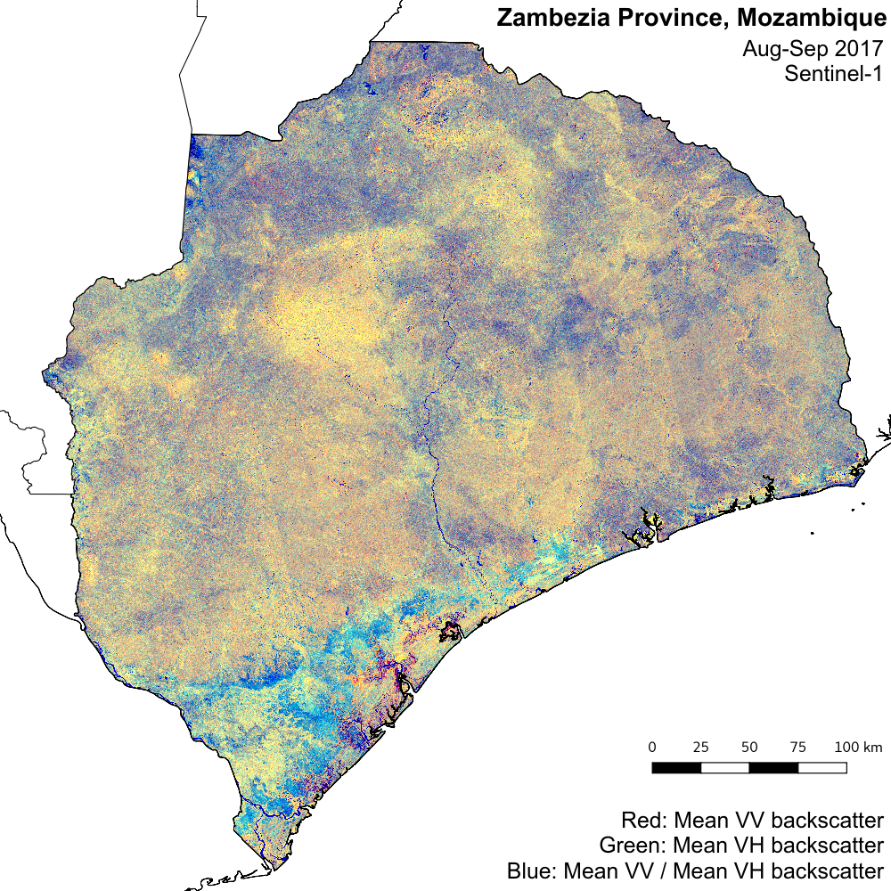

.. _worked_example_commandline:

Worked example on the command line
==================================

Here we'll show you by example how the sen1mosaic processing chain works in practice. We will focus on an example from Zambezia Province of Mozambique, with the aim of creating a composite GeoTiff mosaic product for the province. The extent of Zambezia Province extends roughly from **35 to 40** degrees longitude and **-19 to -15** degrees latitude. We will generate a mosaic for the dry season (**August**) of **2016**, in anticipation of multiple seasonally-specific mosaics improving classification accuracy.

Preparation
-----------

First ensure that you've followed :ref:`setup` successfully.

Open a terminal, and use ``cd`` to navigate to the location you'd like to store data.

.. code-block:: console
    
    cd /home/user/DATA
    mkdir worked_example
    cd worked_example

Use mkdir to make a directory for the region to be downloaded, and navigate to that directory.

.. code-block:: console
    
    mkdir zambezia_data
    cd zambezia_data

Downloading data
----------------

The first step is to download Sentinel-1 GRD IW data from the `Copernicus Open Access Data Hub <https://scihub.copernicus.eu/>`_.

For this we use the ``download.py`` tool. We will need to specify a Scihub username and password (sign up for an account at `Scihub <https://scihub.copernicus.eu/>`_), the extent to download (in degrees lat/lon), and a start and end date in the format YYYYMMDD.

We will limit the download to only the ascending passes, which limits data volume and results in a cleaner mosaic where the geometric distortions from terrain are consistent. At our Mozambique study site Sentinel-1 returns data from both the ascendinfg and descending pass, but note there are regions where data are only available from a single overpass (see: `https://sentinel.esa.int/web/sentinel/missions/sentinel-1/observation-scenario <https://sentinel.esa.int/web/sentinel/missions/sentinel-1/observation-scenario/>`_)

These options can be encoded as follows:

.. code-block:: console
    
    s1m download -u user.name -p supersecret -a 35 -19 40 -15 -s 20170501 -e 20170630 -d ASCENDING

As we didn't specify the option ``-o`` (``--output``), data will output to the current working directory. The data format will be ``.zip``, which can be read directly by sen1mosiac without extraction.

Wait for all files to finish downloading before proceeding to the next step. By the time the processing is complete, your ``zambezia_data/`` directory should contain a list of Sentinel1 .zip files (show files in the currenty working directory with the command ``ls``).

.. code-block:: console
    
    S1B_IW_GRDH_1SDV_20170803T160647_20170803T160716_006777_00BED2_4455.zip
    S1B_IW_GRDH_1SDV_20170803T160716_20170803T160741_006777_00BED2_9B1E.zip
    S1B_IW_GRDH_1SDV_20170803T160741_20170803T160806_006777_00BED2_6BCE.zip
    ...
    S1B_IW_GRDH_1SDV_20170827T160807_20170827T160832_007127_00C900_F95D.zip
    S1B_IW_GRDH_1SDV_20170829T155108_20170829T155137_007156_00C9CB_7F9D.zip
    S1B_IW_GRDH_1SDV_20170829T155137_20170829T155202_007156_00C9CB_49E9.zip

Preprocessing Sentinel-1 GRD data
---------------------------------

The next step is to perform the preprocessing steps that convert raw Sentinel-1 data to usable terrain corrected images. We do this with the graph processing tool (``gpt``) bundled with SNAP.

To perform atmospheric correction and cloud masking we call the tool ``preprocess.py``. We need to specify Sentinel-1 input files, a directory containing Sentinel-1 .zip files, or a single Sentinel-1 .zip file. We will use default options, except for adding in a speckle filter to reduce image noise. 

To process all Sentinel-1 input files, we can submit the following line:

.. code-block:: console

    s1m preprocess -f -v

This command will loop through each Sentinel-1 input file, stitch together images from the same satellite overpass and process them sequentially. You might alternatively want to specify multiple processes to run similaneously (with the ``-p`` flag), although bear in mind that this will require access to a large quantity of memory.

Here we didn't specify the options ``-o`` (``--output_dir``) which can be used to output data to a location other than the directory containing input files, or the ``-r`` (``--remove``) option, which would delete Sentinel-1 .zip files once data is finished processing.

Wait for all files to be processed to level 2A before proceeding. If you run ``ls`` again, your ``zambezia_data/`` directory should now contain a new set of files:

.. code-block:: console
    
    S1_L2_20170803_160647_160831_006777_00BED2.data
    S1_L2_20170803_160647_160831_006777_00BED2.dim
    S1_L2_20170805_155107_155201_006806_00BF9E.data
    S1_L2_20170805_155107_155201_006806_00BF9E.dim
    ...
    S1_L2_20170827_160648_160832_007127_00C900.data
    S1_L2_20170827_160648_160832_007127_00C900.dim
    S1_L2_20170829_155108_155202_007156_00C9CB.data
    S1_L2_20170829_155108_155202_007156_00C9CB.dim

Generating a mosaic for classification
--------------------------------------

After you have preprocessed all the Sentinel-1 .zip files, the final step is to mosaic these into a larger tiling system in preparation for image classification. The tool ``mosaic.py`` will generate summary statistics (mean, min, max, and standard deviation) for each input polarisation in the widely-used GeoTiff format. 

Here we will generate a single output tile coverng the entirity of Zambezia province at 50 m resolution with the limits **710,500 to 1,250,000** m Eastings and **7,890,000 - 8,330,000** m Northings (**UTM 36S**). We'll generate mosaic for both VV and VH polarisations, and output data a name ('worked example') to identfy this tile.

To perform this step, we can run the following script:

.. code-block:: console

    s1m mosaic -te 710500 7890000 1250000 8340000 -e 32736 -r 50 -v -n worked_example

Here we didn't specify an input directory (the script defaults to processing all compatable files in the current working directory) or the ``-o`` (``--output_dir``) option, meaning that results will be output to the current working directory. Once processing is complte, you can use ``ls`` to view the newly created output files:

.. code-block:: console
    
    worked_example_max_VH_R50m.tif
    worked_example_max_VV_R50m.tif
    worked_example_mean_VH_R50m.tif
    worked_example_mean_VV_R50m.tif
    worked_example_mean_VVVH_R50m.tif
    worked_example_min_VH_R50m.tif
    worked_example_min_VV_R50m.tif
    worked_example_stdev_VH_R50m.tif
    worked_example_stdev_VV_R50m.tif
    worked_example_VVmean_VHmean_VVVH.vrt
    worked_example_VVmin_VHmin_VVstdev.vrt

Viewing data
------------

In addition to a GeoTiff files with summary statistics for each Sentinel-1 polarisation (VV, VH), ``mosaic.py`` outputs two 3-band GDAL virtual dataset files (``.vrt``). These are labelled ``_VVmean_VHmean_VVVH_R*.vrt`` and ``_VVmin_VHmin_VVstdev_R*.vrt``, and can be opened in QGIS to show two different false colour composites of Sentinel-1 data. The first shows:

* Red: mean VV backscatter
* Green: mean VH backscatter
* Blue: mean VV dividided by mean VH backscatter

and the second shows:

* Red: minimum VV backscatter
* Green: minimum VH backscatter
* Blue: standard deviation of VV backscatter

 
See also
--------

This example required a lot of manual typing. We can achieve further automation through Python. To see an example of how to run achieve the same results in Python, see the scripts in the sectiomn :ref:`worked_example_python`.

